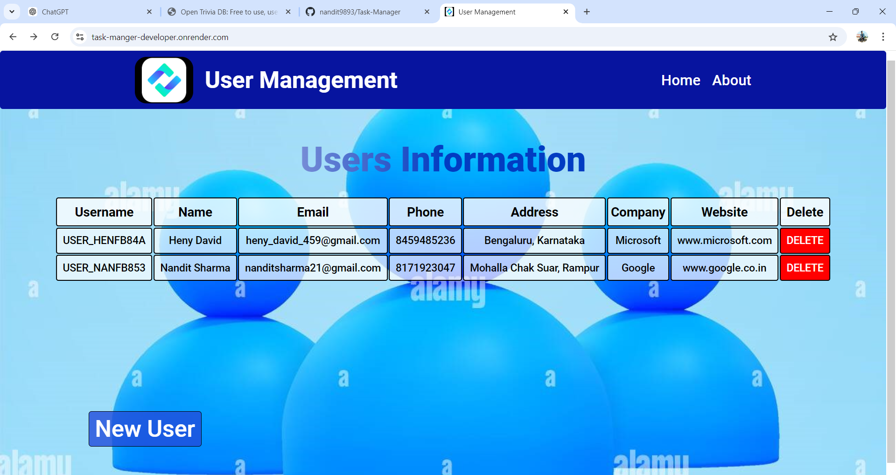
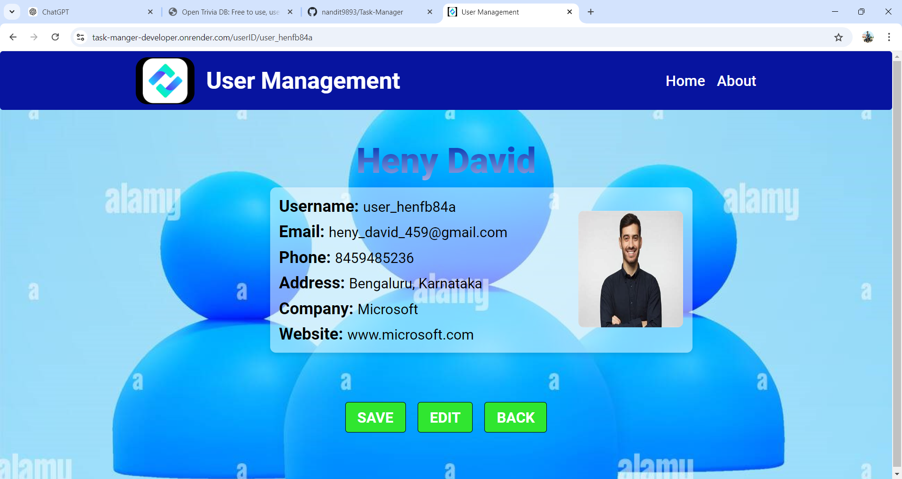
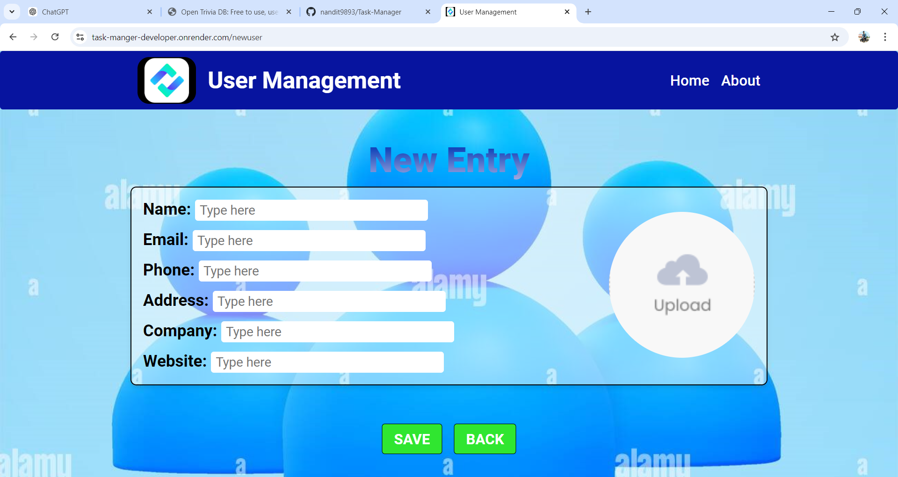

# User Data Management
This project is a fully functional user data management developed using the MERN stack (MongoDB, Express.js, React.js, and Node.js). The website features a user-friendly shopping interface, robust authentication, and essential features. Below is a detailed overview of the application's features, and the technologies used.

**Visit**: https://task-manger-developer.onrender.com

## Key Features
### Home
- Displays a list of all users with their information including username, name, email, phone, address, company, and website.
- Allows users to click on a username to view specific user details.
- Provides an option to delete a user with a confirmation toast notification.
- Button to navigate to the New User form for adding new users.

### Specific User Data
- Each user can be viewed in detail by clicking on their username.
- Users can edit their information and update their details.

### New User Data
- A dedicated form to create new user entries.
- Validations to ensure the integrity of user data.

## Technologies Used
- **Frontend**: React.js, React Router, Axios, React Toastify
- **Backend**: Node.js, Express.js
- **Database**: MongoDB
- **Deployment**: Render.com

### Images
## Home 

## User Data

## New User Data

